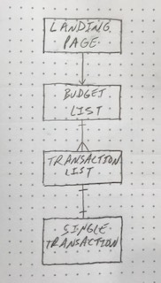
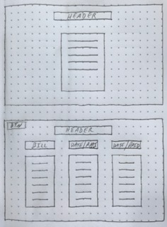

# Budget App
My Project 3 is a budgeting app. 

## Links

1. Trello - https://trello.com/b/XRhoG4dA/budget-app
1. Heroku - https://budget-app-marksei22.herokuapp.com/ 

## Coding languages and libraries

* HTML
* CSS
* JavaScript
* Express
* Mongoose
* Node.js
* AJAX
* React
* Material-UI

## Features

* Add, view, edit, and delete a budget name
* View list of budgets
* Add, view, edit, and delete an item in a budget
* View list of items in a budget
* Add, view, edit, and delete income entries
* View a list of income entries

## ERD:

## Wireframe:

## Cited Code:
* 

## Future Release Features:
* Show values in red if payment was higher than estimated
* Show value of balance in red if it goes below .00
* Show date paid in red if paid late
